# Docker + Kubernetes 快速入门

# Docker

## 安装

### Linux安装

以CentOS为例

```shell
# yum-utils yum工具集
# device-mapper 安装数据存储的数据包
sudo yum install -y yum-utils device-mapper-persistent-data lvm2

# 设置稳定的仓库
sudo yum-config-manager \
    --add-repo \
    https://download.docker.com/linux/centos/docker-ce.repo
    
# 安装docker
sudo yum -y install docker-ce docker-ce-cli containerd.io
```

提示安装成功后启动docker

```shell
sudo service docker start

# 或者
sudo systemctl start docker

# 查看docker版本
docker version

# Hello World
# 从远端服务器拉取hello-world服务
docker pull hello-world

# 运行hello-world
docker run hello-wold
```

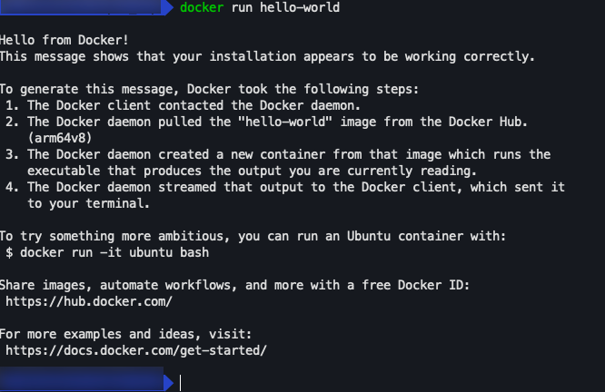


### Mac/Windows安装

1、直接在官网选择对应版本的Docker Desktop进行安装

https://www.docker.com/get-started/

2、安装成功后进行镜像加速配置

```plain
"registry-mirrors": [
    "镜像加速地址"
 ]
```

- 科大镜像：https://docker.mirrors.ustc.edu.cn/
- 网易：https://hub-mirror.c.163.com/
- 阿里云：https://<你的ID>.mirror.aliyuncs.com
- 七牛：https://reg-mirror.qiniu.com

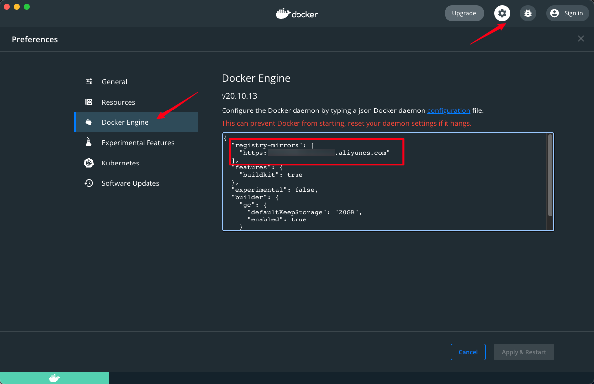

其中，阿里云镜像加速需要自己开通<容器镜像服务>

链接地址：https://cr.console.aliyun.com/cn-hangzhou/instances/mirrors，登陆后，在菜单选中镜像加速期就可以看到自己的专属地址

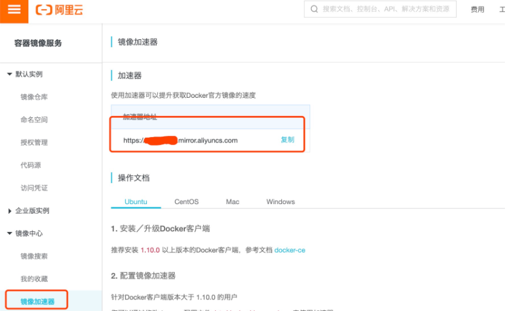


## 基本概念

Docker是提供应用打包，部署与运行用用的容器化平台


### 体系结构

暂略，待补充


### 容器与镜像

- 镜像

- - 镜像是文件，是只读的，提供了运行程序完整的软硬件资源，是应用程序的“集装箱”

- 容器

- - 是镜像的实例，由Docker负责创建，容器之间彼此隔离


### 执行流程

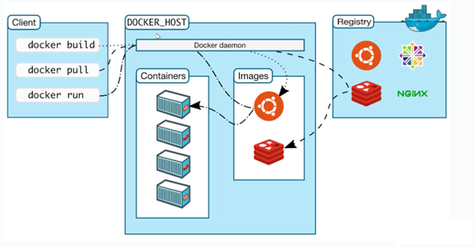


## 常用命令

〈〉内为可选项

- docker pull 镜像名<:tags>		从远程仓库抽取镜像
- docker images					查看本地镜像
- docker run 镜像名<:tags>		创建容器，启动应用
- docker stop 容器id				停止指定的运行的容器
- docker ps						查看正在运行中的镜像
- docker rm <-f> 容器id			删除容器，-f 参数强制删除
- docker rmi <-f> 镜像名<:tags>	删除镜像，-f 参数强制删除


### 快速部署Tomcat示例

1、拉取tomcat

docker pull tomcat ——会拉取最新版本的tomcat

拉取制定版本的tomcat： docker pull tomcat:8.5.77-jre8-temurin-focal


2、运行tomcat

docker run tomcat —— 默认会运行latest版本

运行指定版本tomcat：docker run tomcat:8.5.77-jre8-temurin-focal

直接运行为前台运行方式


3、后台运行，且让宿主机和容器通信

docker run -p 8000:8080 tomcat

本地浏览器测试：http://ip:8000

后台运行

docker run -p 8000:8080 -d tomcat


4、删除指定版本的tomcat镜像

docker rmi tomcat:8.5.77-jre8-temurin-focal


## 容器内部结构


tomcat示例

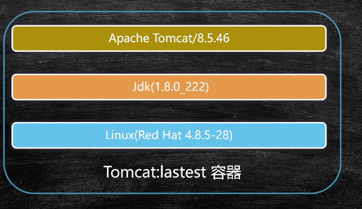


**在容器中执行命令**

格式：docker exec [-it] 容器id 命令

exec：在对应容器中执行命令

-it：采用交互方式执行命令

示例


退出容器交互

exit


docker 默认安装目录：/var/lib/docker

### 容器的生命周期

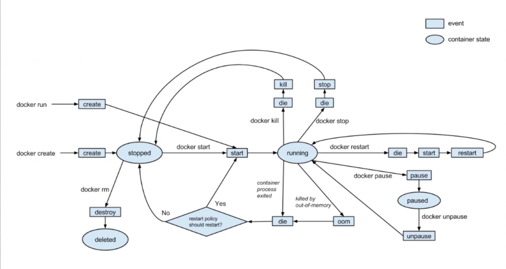


## Dockerfile构建镜像

Dockerfile是一个包含用于组合镜像的命令的文本文档；Docker通过读取Dockerfile中的指令按步骤自动生成镜像

docker build -t 机构/镜像名<:tags> Dockerfile目录

 Dockerfile目录可以是绝对路径，也可以是相对路径

### 自动部署Tomcat示例


1、启动 tomcat:8.5.77-jre8-temurin-focal

2、新建docker-test目录，在docker-test目录下新建docker-web作为要构建的应用

3、在docker-web目录下新建index.html

```html
<h1>Hello Docker</h1>
```

4、在docker-web同级目录新建Dockerfile  (注意文件名完全一致，不要有任务后缀)

```plain
FROM tomcat:8.5.77-jre8-temurin-focal
# 设置当前镜像是哪个机构的
MAINTAINER chenpi
# 切换工作目录，不存在则创建
WORKDIR /usr/local/tomcat/webapps
# 复制目录下的所有文件到容器目录
ADD docker-web ./docker-web
```

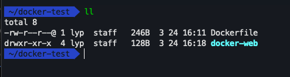

5、构建镜像

```shell
docker build -t chenpi/chenpi-web:2.0 .
```

Dockerfile和要构建的应用在同一级，写相对路径 " . " 即可

构建完成后查看镜像

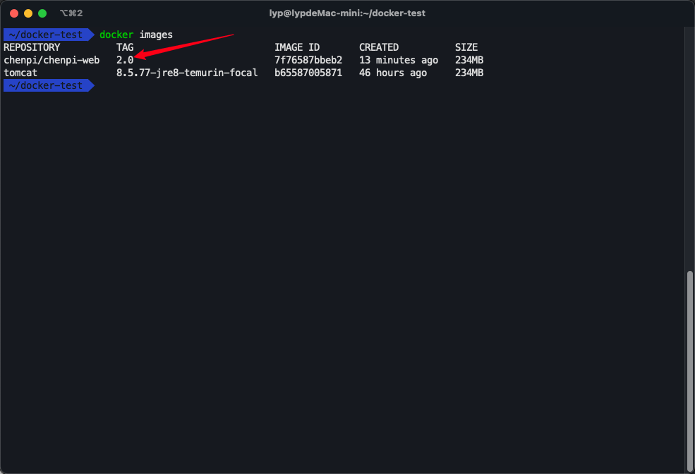

6、运行刚才构建的镜像, 在浏览器中访问测试 http://docker宿主机ip:8001/docker-web/index.html

```shell
docker run -d -p 8001:8080 chenpi/chenpi-web:2.0
```

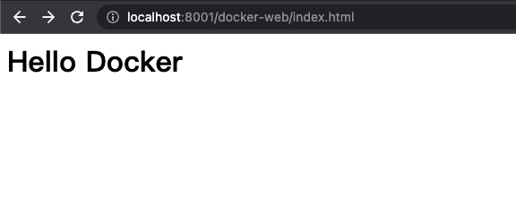

### 镜像分层（layer）概念

在Dockerfile构建时会产生临时镜像，如果修改Dockerfile后进行构建，没有修改的部分会直接使用临时镜像，节省构建时间，后面修改了的才会构建新的临时镜像，最终输出新的完整镜像

示例演示待补充


### 基础指令

- FROM - 基于基准镜像

- - FROM centos  #制作基准镜像（基于centos:lastest）
  - FROM scratch  # 不依赖任务基准镜像base image
  - FROM tomcat:8.5.77-jre8-temurin-focal  
  - 尽量使用官方提供的Base Image


- WORKDIR - 设置工作目录

- - WORKDIR /usr/local
  - WORKDIR /usr/local/newdir	#自动创建新目录
  - 尽量使用绝对路径


- ADD & COPY - 复制文件

- - ADD hello/   # 复制到根路径
  - ADD test.tar.gz /   # 添加根目录并解压
  - ADD 除了复制，还具备添加远程文件功能（类似wget）


- EVN - 设置环境变量

- - EVN JAVA_HOME /usr/local/openjdk8
  - RUN ${JAVA_HOME}/bin/java -jar test.jar
  - 尽量使用环境变量，可提高程序维护性


### 执行指令

RUN & CMD & ENTRYPOINT

- RUN：在Build*构建*镜像时执行命令  docker  build

- - 命令格式

- - - RUN yum install -y vim	# Shell 命令格式
    - RUN ["yum", " install",  "-y",  "vim"]  # Exec命令格式


- CMD：容器在启动后执行默认的命令或参数  docker run

- - CMD用于设置默认执行的命令
  - 如Dockerfile中出现多个CMD，则只有最后一个被执行
  - 如容器启动时附加指令，则CMD被忽略
  - CMD ["ps", "-ef"]	#推荐使用Exec格式


- ENTRYPOINT：容器启动时执行的命令 docker run

- - ENTRYPOINT(入口点)用于在容器启动时执行命令
  - Dockerfile中只有最后一个ENTRYPOINT会被执行
  - ENTRYPOINT ["ps"]	#推荐使用Exec格式


### Dockerfile部署Redis示例

示例只做熟悉命令，平时直接使用官方提供的Redis即可

```haskell
docker pull redis:6.2.6-alpine3.15
```


1、准备好redis的安装包和配置文件

配置文件修改端口号为7000

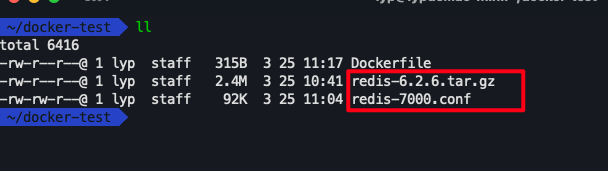

2、编写Dockerfile

```plain
FROM centos:centos7
RUN ["yum", "install", "-y", "gcc", "gcc-c++", "net-tools" , "make"]
MAINTAINER chenpi
WORKDIR /usr/local
# 自带解压
ADD redis-6.2.6.tar.gz .
WORKDIR /usr/local/redis-6.2.6/src
# 编译redis
RUN make && make install
WORKDIR /usr/local/redis-6.2.6
ADD redis-7000.conf .
# 开放7000端口
EXPOSE 7000
CMD ["redis-server", "redis-7000.conf"]
```

3、开始构建

4、启动自己构建的redis

```shell
 docker run -p 7000:7000 chenpi/chenpi-redis:6.2
```

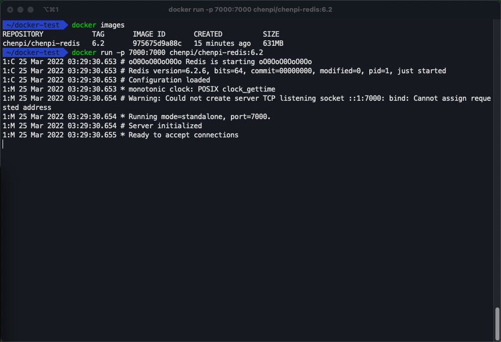


## 容器间通信

### Link单向通信

每个docker容器中会有一个虚拟ip。这些虚拟ip可以进行网络通信，但Ip地址可能会变，导致需要重新配置。当集群量非常大的时候变得非常不好维护，所以可以用名称来进行网络通


构建单向通信

使用name参数

```shell
# 启动一个tomcat容器，并命名为 web
docker run -d --name web tomcat

# 启动一个centos容器，并命名为database， 这里添加/bin/bash命令是为了防止centos容器自动结束
docker run -d --name database -it centos /bin/bash

# 此时这两个容器只能使用docker维护的虚拟ip进行网络通信
# 查看容器的配置信息, 找到 NetworkSettings 中 IPAddress  docker inspect 容器id
docker inspect cd824fba8244
```

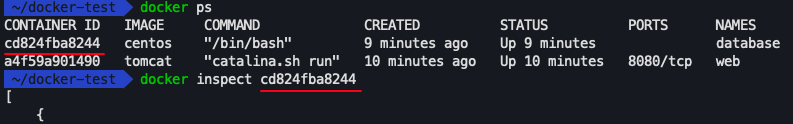

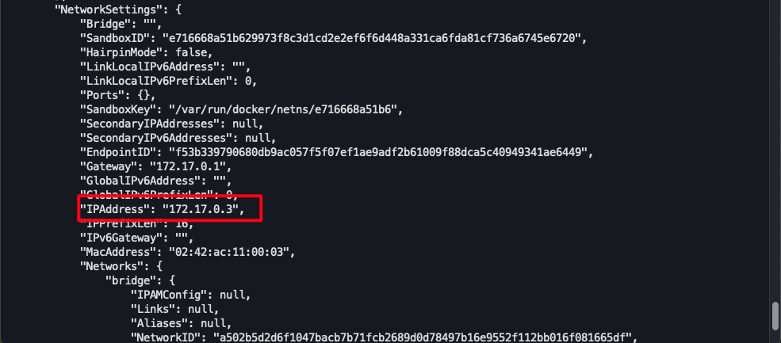

同样查看另一个容器的信息，网络配置为：172.17.0.2

进入命名为database的容器，测试网络

```shell
docker exec -it 容器id /bin/bash
```

ping ip地址可以看到是可以进行网络通信的

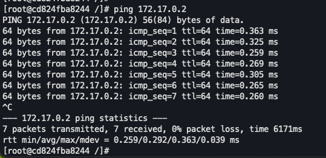

使用名称不行

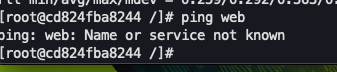

建立单向link链接

```shell
# 先关闭删除之前的web（tomcat）容器，再link启动,之后进行ping 名称测试
docker rm -f web（tomcat）的容器id
# 进行link链接
docker run -d --name web --link database tomcat
# 进入web(tomcat)中进行ping database 测试
```

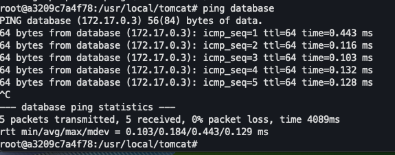


进入web(tomcat) 没有ping命令处理方案

```shell
apt update

apt install -y net-tools

apt install -y iproute2

apt install -y iputils-ping
```


### Bridge网桥双向通信

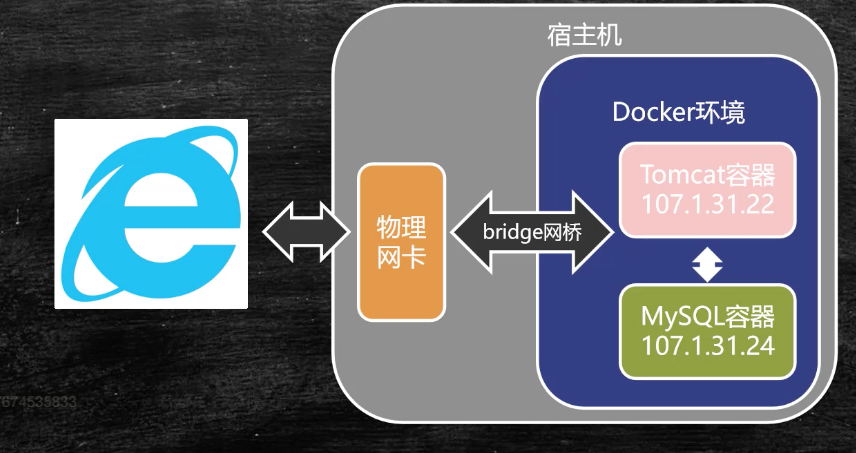


容器从网络层面进行分组

```shell
# 查询网络制式
docker network ls

# 创建网桥
docker network create -d bridge my-bridge

# 绑定两个容器
docker network connect my-bridge web
docker network connect my-bridge database

# 再各自进入容器，测试ping 对方容器名
```

网桥实现原理

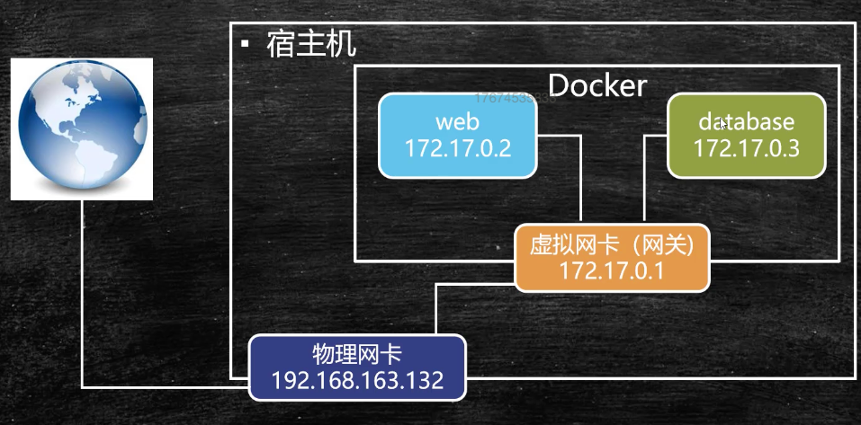


### Volume（数据卷）容器间共享数据

开辟一块公共的存储空间

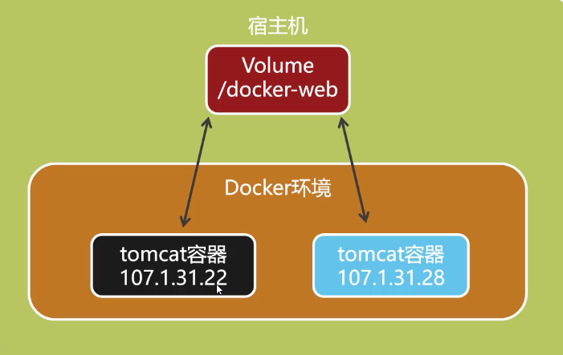

#### 通过设置 -v 挂载宿主机目录

```shell
# 格式：docker run -- name 容器名 -v 宿主机路径:容器内挂载路径 镜像名:tags
docker run -- name t1 -v /Users/chenpi/webapps:/usr/local/tomcat/webapps tomcat:8.5.77-jre8
```

#### 通过 --volumes-from 共享容器内挂载点

```shell
# 创建共享容器
docker create --name webpage -v /Users/chenpi/webapps:/usr/local/tomcat/webapps tomcat /bin/true

# 共享容器挂载点
docker run --volumes-from webpage --name t1 -d tomcat
```


示例演示

1、宿主机文件路径及文件

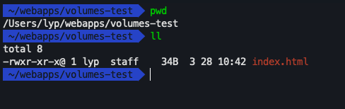

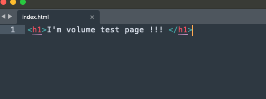

2、挂载宿主机目录

```shell
docker run --name t1 -p 8000:8080 -d -v /Users/lyp/webapps:/usr/local/tomcat/webapps tomcat
```

3、访问测试 http://宿主机ip:8000/volumes-test/index.html

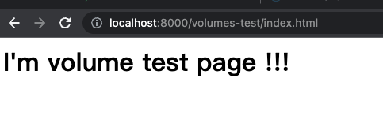

3、进入容器进行查看

```shell
# 查看正在运行的容器
docker ps 

#进入容器内部 85351d3e2deb 为查询到的容器id
docker exec -it 85351d3e2deb /bin/bash 
```

可以看到webapp目录下有宿主机的volumes-test文件夹

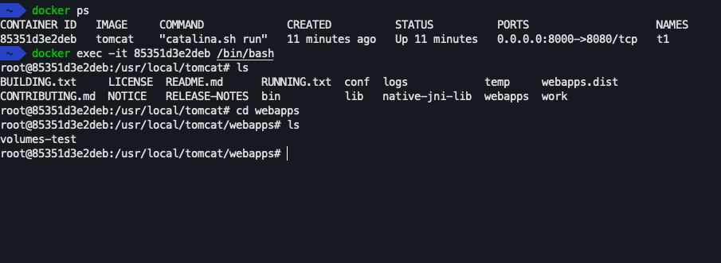

4、在创建一个tomcat测试

```shell
docker run --name t2 -p 8001:8080 -d -v /Users/lyp/webapps:/usr/local/tomcat/webapps tomcat
```

浏览器访问http://宿主机ip:8001/volumes-test/index.html


## Docker-compose

容器编排工具。方便单机多容器部署，通过yml文件定义多容器如何部署；

Docker Compose在桌面级 MAC 和 Windows版本自带，Linux、Windows Server等需要安装

安装页：https://docs.docker.com/compose/install/  按步骤操作即可


快速部署测试，按步骤操作即可

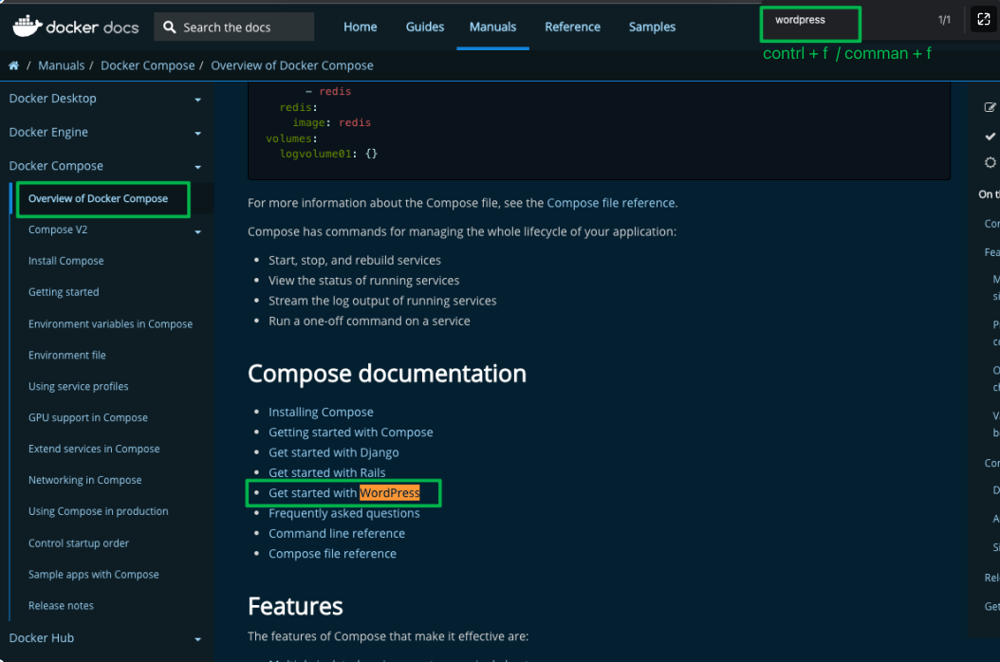


### 应用实战

资料准备：[📎bsbdj.zip](./resource/bsbdj.zip)

bsbdj-app为要部署应用，bsbdj-db为应用的数据库

1、编写 bsbdj-app Dockerfile

```shell
# 基础镜像的选择要注意是否支持arm/x86
FROM openjdk:jdk-oraclelinux8
WORKDIR /usr/local/bsbdj
ADD bsbdj.jar .
ADD application.yml .
ADD application-dev.yml .
# 开放80端口
EXPOSE 80
# docker run 的时候运行cmd

CMD ["java","-jar","bsbdj.jar"]
```

2、进入bsbdj-app目录 构建bsbdj-app

```shell
docker build -t chenpi/bsbdj-app:1.0 .
```

3、此时没有构建数据库，所以app容器运行不起来，准备构建bsbdj-db

```shell
FROM mysql:8.0-oracle
# /docker-entrypoint-initdb.d目录 由mysql官方提供，是初始化数据的目录
WORKDIR /docker-entrypoint-initdb.d
ADD init-db.sql .
```

4、进入 bsbdj-db 目录，构建db

```shell
docker build -t chenpi/bsbdj-db:1.0 .
```

5、启动db

```shell
docker run --name my-db -d -e MYSQL_ROOT_PASSWORD=root chenpi/bsbdj-db:1.0
```

-e：设置环境变量 

后面的参数在mysql官方镜像有说明，此处为设置root账户的初始密码

其他参数查看：https://hub.docker.com/_/mysql?tab=description

6、进入db容器，查看初始化是否成功

```shell
# 进入容器
docker exec -it db容器的id /bin/bash

# 登录mysql
mysql -uroot -proot

# 切换数据库
use bsbdj;

# 查看表格
show tables;

#随便查询一个表格，是否有数据,如：t_user
select * from t_user;
```

### docker-compose构建

```yaml
version: '3.3'
# 注意复数
services:
  # db是服务名；实现网络互通，也是网络的主机名
  db:
    # 要对那个Dockerfile进行解析构建
    build: ./bsbdj-db/
    # 重启
    restart: always
    # 设置环境
    environment:
      MYSQL_ROOT_PASSWORD: root
  app:
    build: ./bsbdj-app/
    # 设置依赖，在构建app的时候，底层会依赖db
    depends_on:
      - db      
    # 注意复数
    ports:
      - "80:80"
    restart: always
```

开始自动构建

```shell
# 构建并运行
docker-compose up -d
```

服务正常运行后访问测试：http://宿主机ip

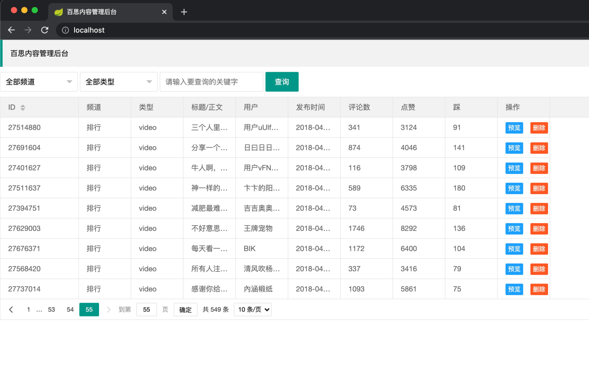

服务下线

```shell
# 下线服务
docker-compose down
```

docker-compose只适合单机部署，只做基础入门，更多配置请参考官网：https://docs.docker.com/compose/


------

# Kubernetes